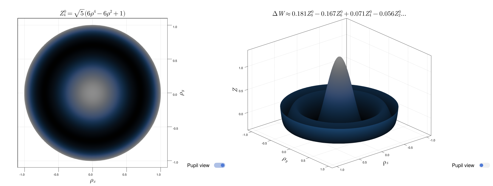

# Zernike.jl

[](https://sagnac.github.io/Zernike.jl/stable) [](https://github.com/Sagnac/Zernike.jl/actions/workflows/ci.yml)

Generates Zernike polynomials, models wavefront errors, and plots them using Makie.



This package can be added from the Julia REPL by:
```julia
using Pkg
Pkg.add(url="https://github.com/Sagnac/Zernike.jl")
```
or entering the package mode by pressing `]` and entering:
```
add https://github.com/Sagnac/Zernike.jl
```

It can then be loaded by typing `using Zernike`.

The package provides 3 main functions for modelling Zernike polynomials and wavefront errors:

* `zernike(m, n)`: Generates a Zernike polynomial, prints its symbolic representation, and plots it using GLMakie;

* `wavefront(ρ, θ, OPD, n_max)`: Fits wavefront errors up to radial order `n_max` given an input set of data over the pupil, returns the Zernike expansion coefficients & various metrics, and plots the modelled wavefront error using GLMakie;

* `transform(v, ε, δ, ϕ, ω)`: Aperture transform function which takes a vector of Zernike expansion coefficients and a set of transformation factors and returns a new set of expansion coefficients over the transformed pupil; the wavefront error over the new pupil is also plotted using GLMakie.

----

## `zernike(m, n)` | `zernike(j)`

Generates a Zernike polynomial.

* `m`: azimuthal order;
* `n`: radial degree;
* `j`: ANSI Z80.28-2004 / ISO 24157:2008 / Optica (OSA) standard single-mode ordering index.

Returns a `Zernike.Output` type which contains (among other things):

* `Z`: the `Polynomial` function `Z(ρ, θ)`;
* `fig`: the `Makie` figure;
* `coeffs`: vector of radial polynomial coefficients;
* `latex`: `LaTeX` string of the Zernike polynomial;
* `unicode`: `Unicode` string of the Zernike polynomial.

The coefficients belong to terms with exponent `n − 2(i − 1)` where `i` is the vector's index.

The radial polynomial coefficients are computed using a fast and accurate algorithm suitable for high orders; it is based on a recursive relation presented by [Honarvar & Paramesran (2013)](https://doi.org/10.1364/OL.38.002487).

----

## `wavefront(ρ, θ, OPD, n_max)`

Estimates wavefront error by expressing optical aberrations as a linear combination of weighted Zernike polynomials using a linear least squares method. The accuracy of this type of wavefront reconstruction represented as an expanded series depends upon a sufficiently sampled phase field and a suitable choice of the fitting order `n_max`.

`ρ`, `θ`, and `OPD` must be floating-point vectors of equal length; at each specific index the values are elements of an ordered triple over the exit pupil.

* `ρ`: normalized radial exit pupil position variable `{0 ≤ ρ ≤ 1}`;
* `θ`: angular exit pupil variable in radians `(mod 2π)`, defined positive counter-clockwise from the horizontal x-axis;
* `OPD`: measured optical path difference in waves;
* `n_max`: maximum radial degree to fit to.

Note that specifying `n_max` will fit using the full range of Zernike polynomials from `j = 0` to `j_max` corresponding to the last polynomial with degree `n_max`. If instead you only want to fit to a subset of Zernike polynomials you can specify a vector of `(m, n)` tuples in place of `n_max` using the method:
```julia
wavefront(ρ, θ, OPD, orders::Vector{Tuple{Int, Int}})
```

If your phase data is in the form of a floating-point matrix instead you can call the method:
```julia
wavefront(OPD, fit_to; options...)
```

This assumes the wavefront error was uniformly measured using polar coordinates; the matrix is expected to be a polar grid of regularly spaced periodic samples with the first element referring to the value at the origin and the end points including the boundary of the pupil (i.e. `ρ, θ = 0.0:step:1.0, 0.0:step:2π`). The first axis of the matrix (the rows) must correspond to the angular variable `θ` while the second axis (the columns) must correspond to the radial variable `ρ`.

If instead your data is not equally spaced you can call:
```julia
wavefront(ρ::Vector, θ::Vector, OPD::Matrix, fit_to; options...)
```
under the aforementioned dimensional ordering assumption.

`fit_to` can be either `n_max::Int` or `orders::Vector{Tuple{Int, Int}}`.

It is also possible to input normalized Cartesian coordinates using the method with 3 positional arguments and passing `fit_to` as a keyword argument:<br>
`wavefront(x, y, OPD; fit_to, options...)`.

The function returns seven values contained within a `WavefrontOutput` type, with fields:

1. `recap`: vector of named tuples containing the Zernike polynomial indices and the corresponding expansion coefficients rounded according to `precision`;
2. `v`: full vector of Zernike wavefront error expansion coefficients;
3. `metrics`: named 3-tuple with the peak-to-valley error, RMS wavefront error, and Strehl ratio;
4. `W`: the `WavefrontError` function `ΔW(ρ, θ)`;
5. `fig`: the plotted `Makie` figure;
6. `axis`: the plot axis;
7. `plot`: the surface plot object.

----

## `transform(v, ε, δ, ϕ, ω)`

Pupil transform function; computes a new set of Zernike wavefront error expansion coefficients under a given set of transformation factors and plots the result.

Available transformations are scaling, translation, & rotation for circular and elliptical exit pupils. These are essentially coordinate transformations in the pupil plane over the wavefront map.

* `v::Vector{Float64}`: vector of full Zernike expansion coefficients ordered in accordance with the ANSI / OSA single index standard. This is the `v` vector returned by `wavefront(ρ, θ, OPD, n_max)`;
* `ε::Float64`: scaling factor `{0 ≤ ε ≤ 1}`;
* `δ::ComplexF64`: translational complex coordinates (displacement of the pupil center in the complex plane);
* `ϕ::Float64`: rotation of the pupil in radians `(mod 2π)`, defined positive counter-clockwise from the horizontal x-axis;
* `ω::NTuple{2, Float64}`: elliptical pupil transform parameters; 2-tuple where `ω[1]` is the ratio of the minor radius to the major radius of the ellipse and `ω[2]` is the angle defined positive counter-clockwise from the horizontal coordinate axis of the exit pupil to the minor axis of the ellipse.

The order the transformations are applied is:<br>
scaling --> translation --> rotation --> elliptical transform.

The translation, rotation, and elliptical arguments are optional.

`ε` = `r₂/r₁` where `r₂` is the new smaller radius, `r₁` the original

In particular the radial variable corresponding to the rescaled exit pupil is normalized such that:<br>
`ρ` = `r/r₂`; `{0 ≤ ρ ≤ 1}`<br>
`r`: radial pupil position, `r₂`: max. radius<br>
`ΔW₂(ρ₂, θ)` = `ΔW₁(ερ₂, θ)`

For translation the shift must be within the bounds of the scaling applied such that:<br>
`0.0 ≤ ε + |δ| ≤ 1.0`.

For elliptical pupils (usually the result of measuring the wavefront off-axis), the major radius is defined such that it equals the radius of the circle and so `ω[1]` is the fraction of the circular pupil covered by the minor radius (this is approximated well by a cosine projection factor for angles up to 40 degrees); `ω[2]` is then the direction of the stretching applied under transformation in converting the ellipse to a circle before fitting the expansion coefficients.

The transformed expansion coefficients are computed using a fast and accurate algorithm suitable for high orders; it is based on a formulation presented by [Lundström & Unsbo (2007)](https://doi.org/10.1364/JOSAA.24.000569).

----

## Options

There are 2 options you can vary using keyword arguments. All 3 main functions support:

* `finesse::Int`: `{1 ≤ finesse ≤ 100}`: multiplicative factor determining the size of the plotted matrix; the total number of elements is capped at 2^20 (~ 1 million) which should avoid aliasing up to ~317 radially and ~499 azimuthally.

Default: `100` (for `zernike`, proportionally scaled according to the number of polynomials for the wavefront errors).

In creating the plot matrix the step size / length of the variable ranges is automatically chosen such that aliasing is avoided for reasonable orders. The `finesse` parameter controls how fine the granularity is subsequently at the expense of performance.

Additionally, the wavefront error functions `wavefront(ρ, θ, OPD, n_max)` and `transform(v, ε, δ, ϕ, ω)` support:

* `precision`: number of digits to use after the decimal point in computing the expansion coefficients. Results will be rounded according to this precision and any polynomials with zero-valued coefficients will be ignored when pulling in the Zernike functions while constructing the composite wavefront error; this means lower precision values yield faster results.

----

Plot options can be set by setting the `Zernike.plotconfig` fields; see the docstring for more details.

----

## `Z`, `W`, `P` functions

Analogs:
```
Z: zernike
W: wavefront
P: transform
```

These methods avoid plotting and instead return `(ρ, θ)` functions as essentially closures, but packaged within `Polynomial` and `WavefrontError` types. The pupil can then be evaluated using these functions with polar coordinates:

```julia
Z40 = Z(0, 4)
Z40(0.7, π/4)
```

For wavefront reconstruction this is equivalent to `ΔW(ρ, θ)` = `∑aᵢZᵢ(ρ, θ)` where `aᵢ` and `Zᵢ` were determined from the fitting process according to `precision`.

Arithmetric between these types is defined using the usual operators such that wavefront error approximations essentially form a commutative ring (with associativity of multiplication being approximate) expressed in a Zernike basis.

In addition, the `Zernike.Superposition(W)` and `Zernike.Product(W)` constructors (where `W` is a `Vector{WavefrontError}`) serve as direct methods for creating composite functions which group evaluate a specified expansion set when an updated set of coefficients is not required.

### Derivatives

`Zernike.derivatives(Z::Polynomial, order::Int = 1)` computes the nth order partial derivatives of `Z(ρ, θ)` and returns the two-tuple (`∂Z/∂ρ`, `∂Z/∂θ`) containing the `PartialDerivative` types.

`Zernike.Gradient(Z::Polynomial)` wraps the first-order partial derivatives and returns a callable `∇Z(ρ, θ)`.

The partials and gradient are also functors which can be evaluated over the pupil.

----

## Single-Index Ordering Schemes

This package uses the ANSI Z80.28-2004 standard sequential ordering scheme where applicable, but provides several functions for converting between two other ordering methods, namely Noll and Fringe. The following methods are available:

* `noll_to_j(noll::Int)`: converts Noll indices to ANSI standard indices;
* `j_to_noll(j::Int)`: converts ANSI standard indices to Noll indices;
* `standardize(noll::Noll)`: re-orders a Noll specified Zernike expansion coefficient vector according to the ANSI standard;
* `fringe_to_j(fringe::Int)`: converts Fringe indices to ANSI standard indices; only indices 1:37 are valid;
* `j_to_fringe(j::Int)`: converts ANSI standard indices to Fringe indices;
* `standardize(fringe::Fringe)`: formats a Fringe specified Zernike expansion coefficient vector according to the ANSI standard;
* `standardize(v_sub::Vector, orders::Vector{Tuple{Int, Int}})`: pads a subset Zernike expansion coefficient vector to the full standard length up to `n_max` (`1:j_max+1`).

The `Noll` and `Fringe` types are used to wrap the input coefficient vectors for the `standardize` method arguments (e.g. `standardize(Fringe(v::Vector{Float64}))`). These can also be used to convert between the ordering schemes (e.g. `Noll(fringe::Fringe)`, `Fringe(s::Standard)`).

The `standardize` fringe method expects unnormalized coefficients; the input coefficients will be re-ordered and normalized in line with the orthonormal standard. As Fringe is a 37 polynomial subset of the full set of Zernike polynomials any coefficients in the standard order missing a counterpart in the input vector will be set to zero.

For the `standardize` subset method the tuples in `orders` must be of the form `(m, n)` associated with the respective coefficients at each index in `v_sub`.

In addition, the functions `get_j(m, n)` & `get_mn(j)` allow you to convert between the single and double indices.

----

## Additional Notes

* `Zernike.metrics(ΔW::WavefrontError)` exists;

* `Zernike.format_strings(m, n)` will return both the `Unicode` and `LaTeX` string representations directly;

* The `zplot` function can be invoked independently using `Polynomial` and `WavefrontError` function types, quantized wavefront errors, and Observables of each; the plot will update each time the `Observable` changes (see the docstring for more info);

* If you resize the plot window, right clicking on the figure will resize / trim the plot automatically so that it fits within the window without extra space;

* `Polynomial` and `WavefrontError` types can be indexed (zero-based) to return a specific coefficient; their full vector of coefficients can be conveniently accessed using single-argument `getindex` (e.g. `z[]`, `w[]`);

* The Zernike polynomials are currently only valid up to degree ~812 at which point the maximum coefficient approaches the maximum for double-precision floating-point numbers (~1e308);
  + because 64-bit floats are used for an expanded range by default the coefficients are exactly accurate up to order ~47, limited by the 53-bit (~1e16) precision of the significand after which results are only approximate; if more accuracy is desired arbitrary precision or plain `Int`s can be specified by passing the appropriate type (`Int`, `BigInt`, `BigFloat`) as the third argument to `Zernike.radial_coefficients`;

* If you're interested in precompiling the package into a system image in order to speed up load times please see the [precompile directory](precompile) (at the moment PrecompileTools or the like is not used);

* If you're interested in only the full vector of Zernike expansion coefficients obtained through the least squares fit and want to avoid computing extra values and plotting the results you can call:
```julia
Zernike.wavefront_coefficients(ρ, θ, OPD, n_max)
```
Similarly you can do this for the radial polynomial coefficients and the NA transformed wavefront error expansion coefficients by importing the functions `radial_coefficients` and `transform_coefficients`, respectively.
