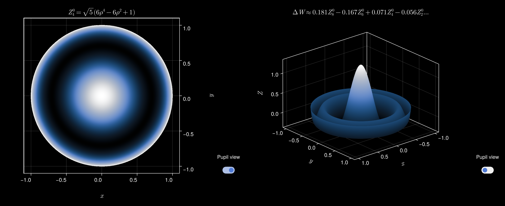

# Zernike.jl

[](https://sagnac.github.io/Zernike.jl/stable) [](https://github.com/Sagnac/Zernike.jl/actions/workflows/tests.yml)

Generates Zernike polynomials & models wavefront errors.



This package can be added from the Julia REPL by:
```julia
using Pkg
Pkg.add(url="https://github.com/Sagnac/Zernike.jl", rev="base")
```
or entering the package mode by pressing `]` and entering:
```
add https://github.com/Sagnac/Zernike.jl#base
```

It can then be loaded by typing `using Zernike`.

This version provides 3 main functions for modelling Zernike polynomials and wavefront errors:

* `Z(m, n)`: Generates a Zernike polynomial;

* `W(ρ, θ, OPD, n_max)`: Fits wavefront errors up to radial order `n_max` given an input set of data over the pupil, returns the Zernike expansion coefficients wrapped in a `Wavefront` type;

* `Y(v, ε, δ, ϕ, ω)`: Aperture transform function which takes a vector of Zernike expansion coefficients and a set of transformation factors and returns a new set of expansion coefficients over the transformed pupil.

**Note: see the full documentation for the stable version based on the master branch; the `zernike`, `wavefront`, and `transform` functions have many of the same method variants as these functions.**

----

## `Z`, `W`, `Y` functions

Analogs:
```
Z: Constructs a Zernike polynomial
W: Fits wavefront errors
Y: Aperture transformation function
```

These methods return `(ρ, θ)` functions as essentially closures, but packaged within `Polynomial` and `Wavefront` types. The pupil can then be evaluated using these functions with polar coordinates:

```julia
Z40 = Z(0, 4)
Z40(0.7, π/4)
```

For wavefront reconstruction this is equivalent to `ΔW(ρ, θ)` = `∑aᵢZᵢ(ρ, θ)` where `aᵢ` and `Zᵢ` were determined from the fitting process according to `precision`.

Arithmetic between these types is defined using the usual operators such that wavefront error approximations essentially form a commutative ring (with associativity of multiplication being approximate) expressed in a Zernike basis.

In addition, the `Zernike.Superposition(W)` and `Zernike.Product(W)` constructors (where `W` is a `Vector{Wavefront}`) serve as direct methods for creating composite functions which group evaluate a specified expansion set when an updated set of coefficients is not required.

Product expansion of radial polynomials can be achieved by passing an azimuthal index and a coefficient vector associated with a sequence of radial polynomials `{Rₙ}` to the `Wavefront{RadialPolynomial}` constructor and then multiplying them to yield a new series in radial polynomials. This MMT quadrature approach is based on a paper by [Cadiot et al. (2024)](https://arxiv.org/abs/2411.18361).

## Derivatives

`Zernike.derivatives(Z::Polynomial, order::Int = 1)` computes the nth order partial derivatives of `Z(ρ, θ)` and returns the two-tuple (`∂Z/∂ρ`, `∂Z/∂θ`) containing the `Derivative` types.

`Zernike.Gradient(Z::Polynomial)` wraps the first-order partial derivatives and returns a callable `∇Z(ρ, θ)`.

The partials and gradient are also functors which can be evaluated over the pupil. In addition, the Unicode representation of partial derivatives can be extracted by calling them with the `String` type.

```jldoctest
julia> ∂ρ, ∂θ = Zernike.derivatives(Z(4, 4));

julia> ∂ρ(String)
"√(10)4ρ³cos(4θ)"
```

----

If the expansion coefficients of the derivatives are desired instead there are several methods available:

`Zernike.grad(Z::Polynomial)` and `Zernike.lap(Z::Polynomial)`.

In addition, the gradient of a `Wavefront` can be computed with `∇(W)`; this del operator / nabla symbol is an alias for `grad`.

----

The `W(∂x, ∂y)` method accepts the gradient of a wavefront in a Zernike basis (e.g. the estimated Zernike expansion coefficients of the transverse aberration components from normalized Shack-Hartmann sensor data) and returns the expansion coefficients of the original wavefront error. The inputs must be in the format of 64-bit floating point vectors representing the normalized Zernike polyomial weights.

----

The three algorithms which compute the expansion coefficients of the gradient, the laplacian, and the original wavefront error from the gradient are based on formulas in [Janssen (2014)](https://doi.org/10.1364/JOSAA.31.001604).

----

## Single-Index Ordering Schemes

This package uses the ANSI Z80.28-2004 standard sequential ordering scheme where applicable, but provides several functions for converting between two other ordering methods, namely Noll and Fringe. The following methods are available:

* `noll_to_j(noll::Int)`: converts Noll indices to ANSI standard indices;
* `j_to_noll(j::Int)`: converts ANSI standard indices to Noll indices;
* `standardize(noll::Noll)`: re-orders a Noll specified Zernike expansion coefficient vector according to the ANSI standard;
* `fringe_to_j(fringe::Int)`: converts Fringe indices to ANSI standard indices; only indices 1:37 are valid;
* `j_to_fringe(j::Int)`: converts ANSI standard indices to Fringe indices;
* `standardize(fringe::Fringe)`: formats a Fringe specified Zernike expansion coefficient vector according to the ANSI standard;
* `standardize(v_sub::Vector, orders::Vector{Tuple{Int, Int}})`: pads a subset Zernike expansion coefficient vector to the full standard length up to `n_max` (`1:j_max+1`).

The `Noll` and `Fringe` types are used to wrap the input coefficient vectors for the `standardize` method arguments (e.g. `standardize(Fringe(v::Vector{Float64}))`). These can also be used to convert between the ordering schemes (e.g. `Noll(fringe::Fringe)`, `Fringe(s::Standard)`).

The `standardize` fringe method expects unnormalized coefficients; the input coefficients will be re-ordered and normalized in line with the orthonormal standard. As Fringe is a 37 polynomial subset of the full set of Zernike polynomials any coefficients in the standard order missing a counterpart in the input vector will be set to zero.

For the `standardize` subset method the tuples in `orders` must be of the form `(m, n)` associated with the respective coefficients at each index in `v_sub`.

In addition, the functions `get_j(m, n)` & `get_mn(j)` allow you to convert between the single and double indices.

----

## Seidel Aberrations & Transfer Functions

Third-order Seidel aberrations at a fixed field can be converted to Zernike polynomials by using `Wavefront(aberr::Zernike.Aberration)` where the `Aberration` constructor accepts the standard wavefront error coefficients.

`OTF(ΔW)` & `MTF(ΔW)` yield the Optical & Modulation Transfer Functions as matrices for the input `Wavefront`.

----

## Additional Notes

* `Zernike.metrics(ΔW::Wavefront)` exists;

* `Zernike.format_strings(Z::AbstractPolynomial)` will return both the `Unicode` and `LaTeX` string representations directly;

* `Zernike.print_strings(j_max::Int)` will print the Unicode string representations of the polynomials up to `j_max`;

* `Polynomial` and `Wavefront` types can be indexed (zero-based) to return a specific coefficient; their full vector of coefficients can be conveniently accessed using single-argument `getindex` (e.g. `z[]`, `w[]`);

* Callable types can be called with complex arguments as a convenient method to evaluate them in Cartesian coordinates;

* The Zernike polynomials are currently only valid up to degree ~812 at which point the maximum coefficient approaches the maximum for double-precision floating-point numbers (~1e308);
  + because 64-bit floats are used for an expanded range by default the coefficients are exactly accurate up to order ~47, limited by the 53-bit (~1e16) precision of the significand after which results are only approximate; if more accuracy is desired arbitrary precision or plain `Int`s can be specified by passing the appropriate type (`Int`, `BigInt`, `BigFloat`) as the third argument to `Zernike.radial_coefficients`;

* If you're interested in only the full vector of Zernike expansion coefficients obtained through the least squares fit and want to avoid computing extra values you can call:
```julia
Zernike.wavefront_coefficients(ρ, θ, OPD, n_max)
```
which will return the weights and the corresponding residual error.

Similarly you can do this for the radial polynomial coefficients and the NA transformed wavefront error expansion coefficients by importing the functions `radial_coefficients` and `transform_coefficients`, respectively.
